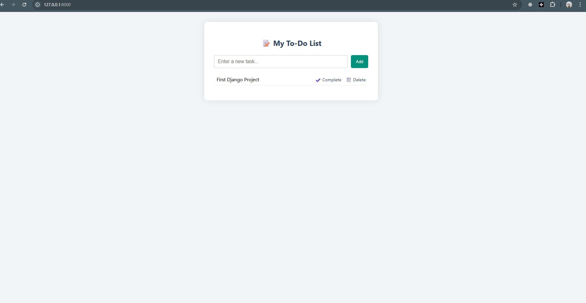

# 📝 Django To-do App

A simple task management web application built using Django.  
Users can add, view, complete, and delete tasks — with a clean user interface.

---

## 🚀 Features

- ✅ Add new tasks
- ✅ View all tasks
- ✅ Mark tasks as complete
- ✅ Delete tasks
- ✅ Clean and responsive UI using custom CSS

---

## 🛠 Tech Stack

- **Backend:** Python, Django
- **Frontend:** HTML, CSS (no JS)
- **Database:** SQLite (default Django DB)
- **Tools:** Django Admin Panel

---

## 📸 


---

## ⚙️ Getting Started

### 1. Clone the Repo

```
git clone https://github.com/yourusername/django-todo-app.git
cd django-todo-app
```

## 2. Create Virtual Environment
``` python -m venv venv
source venv/bin/activate  # Mac/Linux
venv\Scripts\activate     # Windows
```

## 3. Install Dependencies
```
pip install -r requirements.txt
You can create requirements.txt by running:
pip freeze > requirements.txt
```
## 4. Run Migrations
```
python manage.py makemigrations
python manage.py migrate
```
## 5. Create Superuser (for admin panel)
``` python manage.py createsuperuser 
```
## 6. Start the Development Server
```
python manage.py runserver
Then visit: http://127.0.0.1:8000/
```

## 🔐 Admin Panel
```
Login at: http://127.0.0.1:8000/admin/
Manage tasks from the admin dashboard.
```

## 📂 Project Structure
```
todo_project/
│
├── todo/                  # Django app
│   ├── templates/         # HTML templates
│   ├── views.py           # View logic
│   ├── models.py          # Task model
│   ├── urls.py            # App URL config
│
├── todo_project/          # Django project settings
│   ├── settings.py
│   ├── urls.py
│
├── db.sqlite3             # Database
├── manage.py
└── README.md              # You're here!

```
---
## 🙌 Credits
Built by Anoj Rawal as part of Django learning journey.

